# Delta change method in Arctic-EDS

**Questions.**
- Does Arctic-EDS apply the delta change method?
- If not, can Rasdaman/WCPS do the math for us?
- How much would the numbers in the app change?

**Method under review** (from the issue):

| Variable type | GCM delta | Future value |
|---|---|---|
| Not zero-bounded (temperature, degree days) | `G_future − G_hist` | `Baseline + delta` |
| Zero-bounded (precipitation, snowfall, wet days) | `G_future / G_hist` | `Baseline × delta`, with a multiplier cap |

The method needs each GCM's own historical run (`G_hist`). This report never infers or substitutes a missing `G_hist`.

All numbers come from 24 test sites across 7 Alaska regions, pulled from the production Rasdaman (`zeus.snap.uaf.edu`) on 2026-10-08. Every "current" value was checked against the live `earthmaps.io/eds/all` response, and all of them reproduce it.

---

## TL;DR

| Component | Delta change method today | What's needed |
|---|---|---|
| Temperature, precipitation | **Already applied, during data production** (monthly, per model, against each GCM's own 1961–1990 run, added to PRISM 1961–1990). Not reapplied in the API or app, and shouldn't be. | Fix the **baseline mismatch**: the app shows CRU-TS 1901–2015 as "historical", not the 1961–1990 reference the deltas were added to |
| Freezing index, thawing index, HDD | **Not applied.** The app shows raw GCM futures against Daymet. `G_hist` *is* in Rasdaman. | Apply it (additive). WCPS queries are ready and validated |
| Wet days | **Not applied.** Raw WRF futures against ERA-Interim. No `G_hist` in Rasdaman. | Ingest WRF GCM historical runs first |
| Snowfall | Derived product; lineage not established here. No `G_hist` in Rasdaman. | Confirm how the SFE product was built before deciding |

1. **Temperature and precipitation.** The AR5/CMIP5 2 km data are the dataset described in Walsh et al. (2018), which was produced with exactly the issue's delta method. Because the app compares against a different baseline, the change a user reads is the model delta plus a baseline offset. At mid-century:
   - Temperature: the displayed annual change **understates the model delta by 0.07–0.30 °C** (median 0.15 °C). By month the offset ranges from −1.3 to +1.2 °C.
   - Precipitation: the displayed % change is off by **−4.6 to +11.4 pp**. At Bethel the app shows +4%; the model delta is +16%.
   - **Checked against the actual PRISM 1961–1990 files** ([C1](#c1-temperature-and-precipitation-baseline-offset-ar5_baselinepy)):
     - In most of the state the PRISM file and the CRU-TS 2 km 1961–1990 mean agree, and the numbers above stand.
     - In steep mountain terrain they differ. A spatial test shows the AR5 projections share their fine-scale (terrain-driven) pattern exactly with the CRU-TS 2 km data, but not with the downloaded PRISM file. So the steep-terrain numbers use the CRU-TS 1961–1990 mean.
     - The team should confirm which PRISM release was used.
2. **Degree days.** Applying the method shifts the displayed mid-century % change by about 1–3 pp (max 8 pp, freezing index at Kodiak). Min/max ranges move more than means.
3. **WCPS can do the delta math server-side** wherever `G_hist` exists. Point queries take about 0.2 s and match Python exactly, including a cap that actually binds. Statewide grids take one request each ([Part B](#b-can-wcps-do-it-server-side)).
4. **Multiplier caps don't bind for any computable component at annual scale.** A 3× cap and a minimum-denominator threshold remain sensible defaults for when precipitation or wet-day deltas are computed from monthly or daily data.

---

## A. Is the delta change method applied?

### Temperature and precipitation: yes, during data production

The EDS temperature (`tas_2km_projected_wcs`) and precipitation (`annual_precip_totals_mm`) coverages come from SNAP's *Projected Monthly … Products – 2 km CMIP5/AR5*. The rasdaman-ingest notebook pulls them from `CKAN_Data/Base/AK_CAN_2km/projected/AR5_CMIP5_models/`. That product is described in [Walsh et al. 2018](https://pubs.usgs.gov/publication/70200456), doi:10.1016/j.envsoft.2018.03.021 ([open manuscript](https://repository.library.noaa.gov/view/noaa/57850)):

- **Same models:** *"MRI-CGCM3, GISS-E2-R, GFDL-CM3, IPSL-CM5A-LR and NCAR-CCSM4"* (Sec. 4). These are the five GCMs in both coverages.
- **Same grid and scenarios:** a 2 km grid; RCP 4.5, 6.0 and 8.5.
- **Same method as the issue:** *"a model's future change ('delta') … is added to the historical mean value … The delta is computed as the model's change from the period of the historical climatology (1961–1990 in the case of the PRISM data) to a future time slice"* (Sec. 3.2). And: *"For every year and calendar month, the downscaling consisted of calculating the 'delta' value for each GCM grid cell … adding these high resolution 'deltas' to the same high resolution climatology"* (Sec. 4).

So every AR5 value in these coverages is already `PRISM_1961–1990 + (G_future − G_hist,1961–1990)`, computed per model and calendar month. **That is why the GCM historical runs aren't in Rasdaman:** they were consumed during downscaling.

Two caveats:
- The paper produced versions on both the PRISM and CRU TS 3.2 1961–1990 baselines. The SNAP catalog record for the 2 km product ([record](https://catalog.snap.uaf.edu/geonetwork/srv/api/records/ba834996-ad15-4785-9b43-ef2af86a5ad9)) and the Arctic-EDS plate text both point to PRISM. The comparison with the PRISM files in [C1](#c1-temperature-and-precipitation-baseline-offset-ar5_baselinepy) supports PRISM: the two agree to within 0.1 °C and 1% across most of the state, which a 0.5° CRU TS 3.2 climatology would not. In steep terrain, though, the AR5 projections' fine-scale pattern doesn't match the downloaded PRISM file.
- The paper doesn't say whether precipitation deltas were differences or ratios. The analysis below doesn't depend on that.

**The problem is the baseline the app displays.** The plates show CRU-TS 4.0 2 km 1901–2015 statistics as "historical" and compute change against them (`Diff.vue`). The change a user reads is therefore:

```
displayed change = G_fut − CRU_1901–2015
                 = (G_fut − PRISM_1961–1990)        ← the model delta
                 + (PRISM_1961–1990 − CRU_1901–2015) ← baseline offset
```

### Degree days and wet days: no

Data availability was checked by querying every GCM slice over the historical years at all 24 sites ([`check_gcm_historical.py`](check_gcm_historical.py), [`data/gcm_historical_availability.csv`](data/gcm_historical_availability.csv)).

| Component | Coverage | Baseline shown | Future shown | GCM historical values found |
|---|---|---|---|---|
| Freezing / thawing index, HDD | `air_*_index_Fdays`, `heating_degree_days_Fdays` (NCAR 12 km) | Daymet 1980–2009 | 9 GCMs × 2 RCPs, raw | **12,420 of 19,440**¹, so the method **can be applied** |
| Wet days per year | `wet_days_per_year` (WRF 20 km) | ERA-Interim 1980–2009 | GFDL-CM3 / NCAR-CCSM4, raw, 2006–2100 | **0 of 1,248**, so WRF GCM historical runs **must be ingested** first |
| Snowfall (SFE) | `mean_annual_snowfall_mm` | CRU-TS 3.1 1910–2009 | AR5, 5 GCMs × 3 RCPs | **0 of 4,800** |
| *(for reference)* Temperature / precipitation | `tas_2km_*` / `annual_precip_totals_mm` | CRU-TS 4.0 1901–2015 | AR5, already delta-downscaled | none, and none needed (see above) |

¹ Every GCM × RCP track holds 1950–2005 values. The remaining empty cells are the unused `historical` scenario index for GCMs and Ketchikan, which falls outside the NCAR 12 km grid.

Snowfall is derived from SNAP's 771 m AR5 temperature and precipitation (PRISM 1971–2000 baseline) through a snow-fraction calculation. It's excluded here because neither its lineage nor a valid `G_hist` could be established. Permafrost, hydrology, elevation and precipitation frequency are model outputs or static layers and are out of scope.

### Code evidence: the API and app never apply a delta

- **Precipitation.** [taspr.py:1442](../routes/taspr.py#L1442) computes historical statistics from CRU-TS. [taspr.py:1456–1469](../routes/taspr.py#L1456-L1469) pools every GCM × RCP annual value per era.
- **Temperature.** [taspr.py:767–860](../routes/taspr.py#L767) averages the projected `tas_2km` values per era.
- **Degree days.** [degree_days.py:534–560](../routes/degree_days.py#L534-L560) takes Daymet 1980–2009 statistics as `modeled_baseline` and pools raw GCM values. The GCM 1980–2009 values are in the coverage but never read.
- **Snowfall.** [snow.py:85–116](../routes/snow.py#L85-L116) takes CRU decades as historical and pools all GCM decades.
- **Wet days.** [wet_days_per_year.py:44](../routes/wet_days_per_year.py#L44) splits the coverage at 1980–2009 (ERA-Interim) and 2006–2100 (GCMs).
- A search across all EDS routes for `delta|anomal|bias|ratio` finds nothing relevant.
- **Frontend** (`ua-snap/arctic-eds@a25b445`). `Diff.vue` computes `future − past` (abs: temperature, precipitation) or `(future − past) / past` (pct: degree days) from the API's means.

---

## B. Can WCPS do it server-side?

**Yes, wherever `G_hist` is in the coverage** (today, the degree days). [`wcps_server_side.py`](wcps_server_side.py) runs the full calculation in Rasdaman at every test site and checks it against the same formula in numpy on the same data ([`data/wcps_validation.csv`](data/wcps_validation.csv)).

| Index | Formula run in WCPS (mean over 9 GCMs × 2 RCPs, 2040–2069) | Mean time per point | Max \|WCPS − Python\| |
|---|---|---|---|
| Freezing / thawing / HDD | additive: `B + (G_fut − G_hist)` | 0.20 s | 0.000 |
| Freezing / thawing / HDD | multiplicative: `B × min(G_fut / G_hist, 3)` | 0.20 s | 0.000 |

The 3× cap never binds on era means here (the largest ratio is 2.49×), so the cap was also tested with tighter caps that do bind ([`data/wcps_cap_check.csv`](data/wcps_cap_check.csv)). At Utqiagvik's thawing index, WCPS and Python agree exactly:

| Cap | Runs clipped | WCPS = Python | Uncapped |
|---|---|---|---|
| 1.5× | 9 of 18 | 1076.06 | 1240.38 |
| 1.3× | 14 of 18 | 970.06 | 1240.38 |

Example: the additive delta for one point, all 9 GCMs × 2 RCPs, in one request:

```
for $c in (air_freezing_index_Fdays) return encode(
  (double)avg($c[model(0),scenario(0),year(1980:2009),X(x),Y(y)])
  + (condense + over $m model(1:9), $s scenario(1:2)
     using (double)avg($c[model($m),scenario($s),year(2040:2069),X(x),Y(y)])
         - (double)avg($c[model($m),scenario($s),year(1980:2009),X(x),Y(y)])) / 18.0,
  "application/json")
```

For the multiplicative form, the body becomes `min(G_fut / G_hist, 3.0)`. `switch case … return … default return …` and boolean masks also work.

**Statewide grids** take one request each:

| Grid | Resolution | Time | Size | Figure |
|---|---|---|---|---|
| Degree-day adjustment fields | 12 km | 0.7–0.8 s each | 0.6 MB | [Fig. 5](#figures) |
| Precipitation baseline-offset grid | 2 km | 7–77 s (server caching varies) | 16 MB | [Fig. 9](#figures) |

For temperature and precipitation, WCPS can likewise compute baseline offsets or re-anchored values on the fly, since everything they need is in Rasdaman.

### Rasdaman quirks found (relevant to any WCPS implementation)

1. **Mixed-length `avg()` fails.** Combining `avg()` over subsets of different lengths (e.g. 115 vs 30 years) raises *"axes not compatible"*. Workaround: cast each aggregate, as in `(double)avg(...)`.
2. **`condense` over a `year` iterator mis-indexes.** It sends geo years to the wrong grid index, and over an ANSI date axis it hung for more than 2 minutes. Workaround: write out explicit sums of year slices and send the query by POST.
3. **`tas_2km_projected_wcs` has an irregular scenario axis.** Its coefficients are `0, 2`, so RCP 8.5 is `scenario(2)` even though the metadata encoding labels it `"1"`.
4. **GeoTIFF axis order differs by coverage.** The NCAR 12 km coverages come back with X/Y transposed; the AR5 2 km coverages do not.

---

## C. How big is the difference?

### C1. Temperature and precipitation: baseline offset ([`ar5_baseline.py`](ar5_baseline.py))

#### Two candidate 1961–1990 references

| Candidate | Source | Notes |
|---|---|---|
| **PRISM file** | SNAP's *PRISM 1961–1990 Climatologies*, 2 km ([GeoNetwork record](https://catalog.snap.uaf.edu/geonetwork/srv/eng/catalog.search#/metadata/0e8e42f7-6774-4d35-a7b3-4a82f8b48e00)), downloaded GeoTIFFs | Same grid as `tas_2km_*`. The record's title says 1961–1990, but its temporal-coverage fields say 1971–2000; the file names say 1961–1990 |
| **CRU-TS 2 km 1961–1990 mean** | 1961–1990 mean of the CRU-TS 4.0 2 km historical data in Rasdaman (the app's own historical source). **Not PRISM data.** | That product was delta-downscaled onto a PRISM 1961–1990 climatology, so averaging it over 1961–1990 cancels the CRU anomalies and leaves the climatology it was built on. It is an indirect stand-in for that PRISM climatology |

PRISM is sampled at the cell matching the Rasdaman cell the API reads for each site. For precipitation that is the warped `annual_precip_totals_mm` cell's center ([`prism_check.py`](prism_check.py)).

#### Do they agree? ([`data/prism_vs_cru_1961_1990.csv`](data/prism_vs_cru_1961_1990.csv), [Fig. 10](#figures))

Mostly yes:

| Variable | Agreement | Exceptions |
|---|---|---|
| Temperature | 22 of 24 sites within 0.1 °C annually; monthly median difference 0.04 °C | Valdez (−0.53 °C) and Ketchikan (+0.19 °C), up to 0.79 °C in individual months |
| Precipitation | 20 of 24 sites within 1% (e.g. Bethel 382.0 vs 382.0 mm; Juneau 2420 vs 2420 mm) | Anaktuvuk Pass, Homer, Nome and Kotzebue (2–6%). Each has an adjacent PRISM cell that matches to within 0.5%, so these are cell-registration artifacts of the warped precip grid |

#### Which climatology do the AR5 projections share their fine-scale pattern with? ([`climatology_consistency.py`](climatology_consistency.py), [`data/climatology_consistency.csv`](data/climatology_consistency.csv))

This compares spatial patterns, not values. The AR5 projections are several degrees warmer than any historical climatology.

Each AR5 value is `climatology(pixel) + GCM delta(pixel)`, and the GCM delta was interpolated from a ~2.5° model grid, so it varies smoothly over a 15×15-cell (~30 km) block. All terrain-scale detail in the AR5 field comes from the climatology:
- Subtracting the climatology the AR5 data were actually built on leaves only the smooth delta.
- Subtracting a different climatology leaves terrain-scale detail behind.

Leftover roughness (std after removing a best-fit plane) of the block-averaged AR5 2006–2035 field minus each candidate, at all 24 sites:

| Residual | vs CRU-TS 2 km 1961–1990 mean | vs downloaded PRISM file |
|---|---|---|
| Temperature | **0.002–0.005 °C** at every site | 0.007–0.28 °C; worst at Valdez 0.28, Juneau 0.18, Ketchikan 0.14, Anaktuvuk Pass 0.11 |
| Precipitation (log ratio) | **0.0001–0.0016** at every site | 0.0006–0.080 (part of this is precip-grid registration) |

**Conclusion:**
- The AR5 projections and the CRU-TS 2 km historical data share the same underlying high-resolution climatology at every site. It equals the downloaded PRISM file in most terrain but not in steep mountains, where the downscaling evidently used a slightly different PRISM release or processing.
- **Limit of this test:** the CRU anomalies were also interpolated from a coarse (0.5°) grid, so CRU-TS 2 km averaged over *any* period carries the same terrain pattern. The test shows the two datasets share a base climatology, not that it is the 1961–1990 one. That part rests on the paper (1961–1990 delta reference) and on the CRU-TS 1961–1990 mean matching the PRISM 1961–1990 file to within 0.1 °C and 1% outside steep terrain.
- **The results below use the CRU-TS 2 km 1961–1990 mean as the reference**, with the PRISM-file results alongside. The two coincide except at the sites noted.
- Which PRISM release was used, and why the downloaded file differs in the mountains, is a question for the team.

Comparisons match what the app shows:

| Component | Baseline the app shows | Future the app shows |
|---|---|---|
| Temperature | CRU 1901–2015 mean | 5ModelAvg RCP 8.5 annual |
| Precipitation | CRU 1901–2015 mean | 5 GCMs × 3 RCPs pooled, annual totals |

Results at mid-century (2040–2069), 24 sites. The full table is in [`data/ar5_baseline_comparison.csv`](data/ar5_baseline_comparison.csv).

| | Displayed change (vs CRU 1901–2015) | Model delta (vs CRU-TS 2 km 1961–1990 mean) | Difference | Same, using the PRISM file |
|---|---|---|---|---|
| Temperature, annual | +2.6 to +6.2 °C (median +4.2) | +2.7 to +6.5 °C (median +4.3) | **Displayed understates by 0.07–0.30 °C** (largest at Utqiagvik) | −0.38 to +0.31 °C; differs only at Valdez (−0.38 vs +0.15) and Ketchikan (+0.30 vs +0.11) |
| Temperature, by month | — | — | **About −1.3 to +1.2 °C** | [Fig. 8](#figures) uses the PRISM file: −1.33 to +1.19 °C |
| Precipitation | +4.4% to +28.2% | +5.5% to +26.8% | **−4.6 to +11.4 pp** (median \|shift\| 2.9 pp) | −6.1 to +11.4 pp; differs at Anaktuvuk Pass, Homer, Nome and Kotzebue (registration) |

Per-site values for both references are in [`data/ar5_baseline_comparison.csv`](data/ar5_baseline_comparison.csv). Fig. 7 shows them together.

How the precipitation offset varies across the state ([Fig. 9](#figures); by site and era in [Fig. 11](#figures)):

| Area | App baseline vs 1961–1990 | Effect on displayed % change | Example sites |
|---|---|---|---|
| Western Alaska / Y-K Delta | wetter | **understated** | Bethel +4.4% → +15.8%; Unalakleet +10.2% → +19.4%; Nome +12.0% → +17.5% |
| Southeast, Southcentral, eastern Interior | drier | **overstated** | Yakutat +12.3% → +7.7%; Homer +18.9% → +14.3%; Juneau +10.8% → +6.8% |

Because the offset is a constant in each era, it matters proportionally more early in the century. The monthly temperature pattern (February, April and October–November baselines warmer than 1961–1990; January in the west colder) also affects the monthly tables the app shows, more than the annual numbers suggest.

### C2. Degree days: delta change method ([`analyze.py`](analyze.py))

| Term | Definition |
|---|---|
| `B` | Daymet 1980–2009 mean (the "modeled baseline" the app shows) |
| `G_hist` | Each GCM × RCP track's own 1980–2009 mean |

Every future model-year is adjusted as `max(B + (G_year − G_hist), 0)`, then summarized into min/mean/max per era exactly as the API does today. The multiplicative form with 1.5×, 2× and 3× caps is in [`data/summary_long.csv`](data/summary_long.csv).

Results at mid-century (2040–2069), 23 sites. The full per-site, per-era table is in [`data/comparison.csv`](data/comparison.csv).

| Index | Mean value shift, delta − current (median, range) | Median \|shift\| in displayed % change | Max \|shift\| | Where it's largest |
|---|---|---|---|---|
| Freezing index | +80 °F·days (+16 to +279), +4.5% | 2.9 pp | 8.0 pp | Kodiak (−58% → −50%), southern coast |
| Thawing index | −59 °F·days (−83 to −12), −1.5% | 1.9 pp | 6.8 pp | Utqiagvik (+76% → +69%), Deadhorse |
| Heating degree days | +148 °F·days (+61 to +330), +1.4% | 1.2 pp | 1.8 pp | Fairly uniform statewide |

The ensemble's 1980–2009 runs sit slightly off Daymet, so the delta method trims the projected change in every case:

| Index | Ensemble 1980–2009 vs Daymet | Effect |
|---|---|---|
| Freezing index | −1% to −8% | projected losses shrink |
| Heating degree days | −0.6% to −1.8% | projected losses shrink |
| Thawing index | +0.4% to +6.8% | projected gains shrink |

The shift is the same in every era. Individual runs are biased more than the ensemble mean ([Fig. 3](#figures)):

| Index | Per-run bias vs Daymet |
|---|---|
| Freezing index | −16% to +8% |
| Thawing index | −4% to +14% |
| Heating degree days | −4% to +2% |

So the min/max the app reports move more than the means ([Fig. 6](#figures)). Median shifts in the reported minimum:

| Index | Median shift in minimum | Notes |
|---|---|---|
| Freezing index | 4.3% | Near-zero minimums at southern coastal sites swing from −100% (floored to 0) to +152% (Kodiak: 9 → 23 °F·days) |
| Thawing index | −2.7% | — |
| Heating degree days | 2.2% | — |

### Multiplier caps and thresholds

Degree days are sums of temperature, so the additive form fits the issue's rule for non-zero-bounded variables. If they were treated multiplicatively ([Fig. 4](#figures)), here is the share of model-years above each cap:

| Index | > 1.5× | > 2× | > 3× |
|---|---|---|---|
| Thawing index | 18.9% | 2.9% | 0.25% |
| Freezing index | 0.6% | 0.05% | 0 |
| Heating degree days | 0 | 0 | 0 |

Along the far southern coast and in the Aleutians, the freezing-index baseline approaches zero. That is the tiny-denominator case the issue describes, and the additive form avoids it.

---

## Recommendations

1. **Temperature and precipitation: don't reapply the delta method; align the baseline.** Either show the 1961–1990 reference climatology as the plate's historical baseline, or compute the displayed change against it. Both are possible from Rasdaman today, in Python or WCPS. Before shipping:
   - Confirm the EDS coverages are the PRISM (not CRU TS 3.2) variant.
   - ~~Verify that CRU-TS 2 km 1961–1990 equals PRISM 1961–1990 against the PRISM grids.~~ Done. They agree in most terrain, and the AR5 projections share their fine-scale pattern exactly with the CRU-TS 2 km data everywhere. Still open: which PRISM release the downscaling used, since the downloaded file differs in steep terrain and its catalog record lists conflicting periods (1961–1990 vs 1971–2000).
   - If the app shows the 1961–1990 reference as its historical baseline, take it from the CRU-TS 2 km 1961–1990 mean in Rasdaman (or the exact PRISM release used), not the downloaded PRISM file, so it matches the AR5 values pixel for pixel.

   The monthly temperature tables are where this matters most (up to ±1.3 °C).
2. **Degree days: apply the delta change method (additive, floor at 0).** All inputs are in Rasdaman, and the WCPS queries exist and are validated.
3. **Wet days: ingest the WRF GCM historical runs before applying the method.**
4. **Snowfall: establish how the SFE product was built** (baseline, deltas, snow-fraction model) before deciding whether it needs anything.
5. **Shared implementation defaults:** a 3× multiplier cap and a minimum-denominator threshold for zero-bounded variables. Do point queries in WCPS (~0.2 s per component) and precompute statewide grids.

---

## Figures

**Fig. 1: Degree days, mid-century % change shown in the app, current (blue) vs delta change method (orange).**
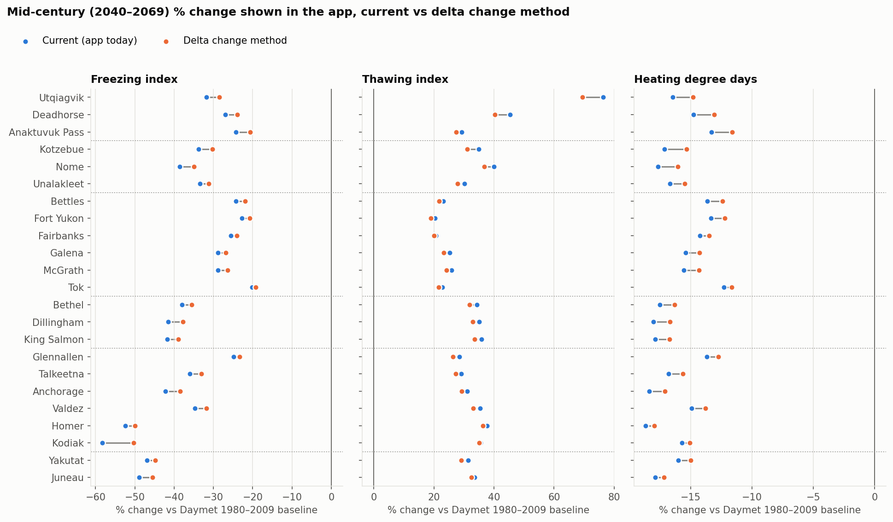

**Fig. 2: Degree days, shift in the displayed % change by site and index.** The same in every era.
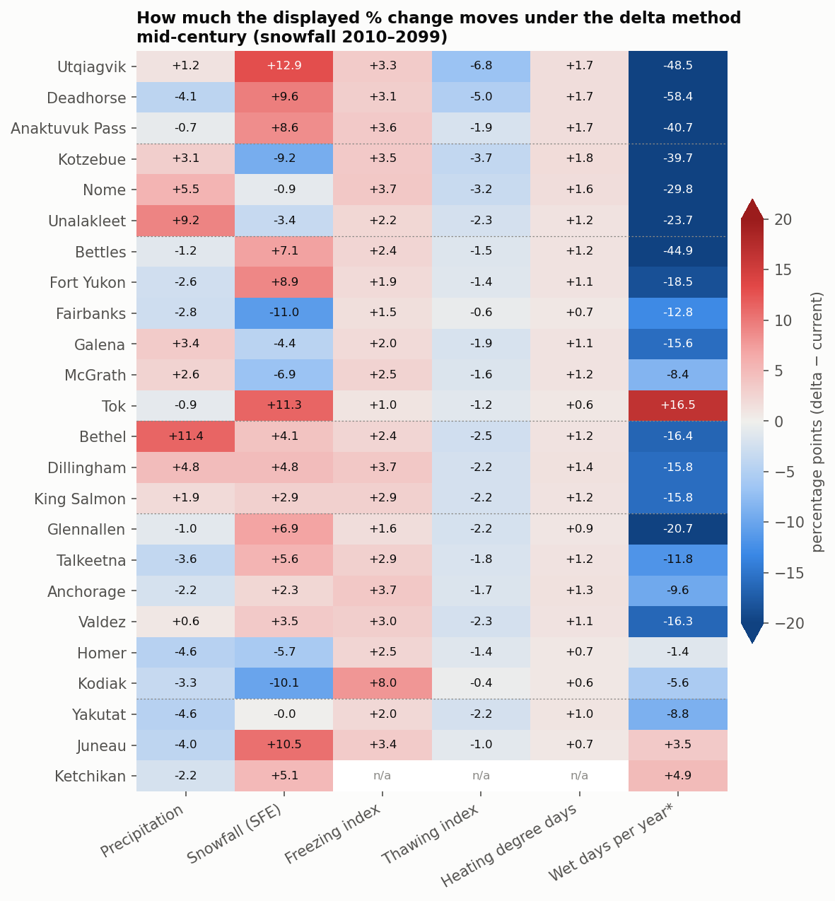

**Fig. 3: Degree days, each GCM's 1980–2009 bias against Daymet.** This is what the delta method removes.
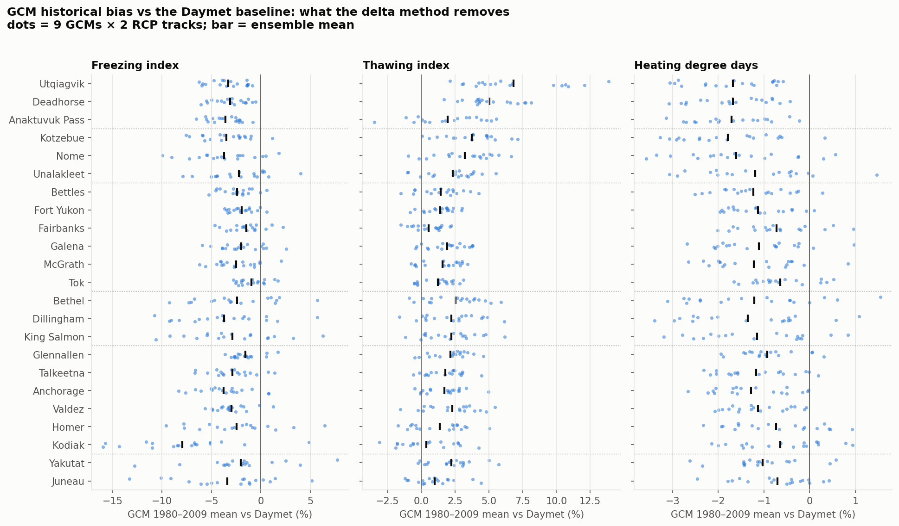

**Fig. 4: Degree days, how often multiplicative caps would bind.**
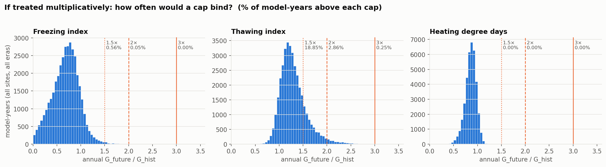

**Fig. 5: Degree days, statewide adjustment fields, each from one WCPS request.**
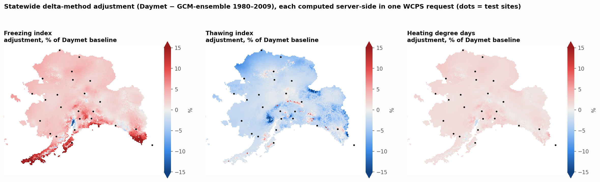

**Fig. 6: Freezing index min/mean/max as the app reports it, current vs delta.**
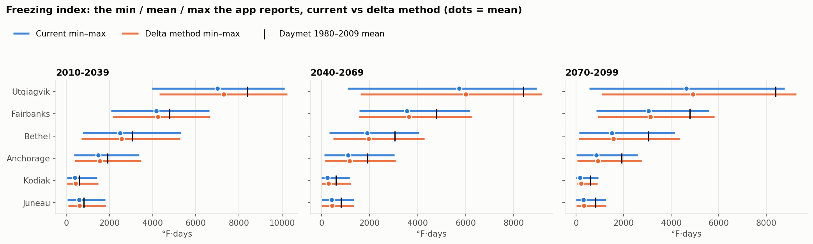

**Fig. 7: Temperature and precipitation, displayed change vs the model delta (mid-century).** Hollow circles use the CRU-TS 2 km 1961–1990 mean (which shares the AR5 projections' underlying climatology); orange dots use the downloaded PRISM file.
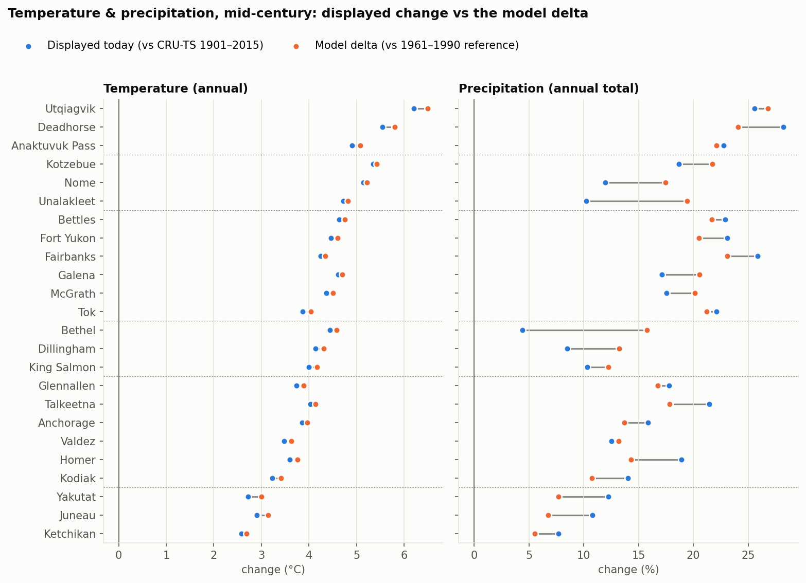

**Fig. 8: Temperature baseline offset by month, against the PRISM file.** Valdez and Ketchikan reflect the PRISM-file differences in steep terrain.
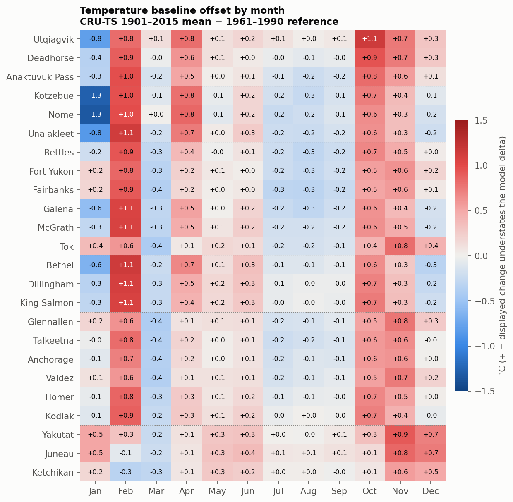

**Fig. 9: Precipitation baseline offset statewide (vs the CRU-TS 2 km 1961–1990 mean), from one WCPS request.**
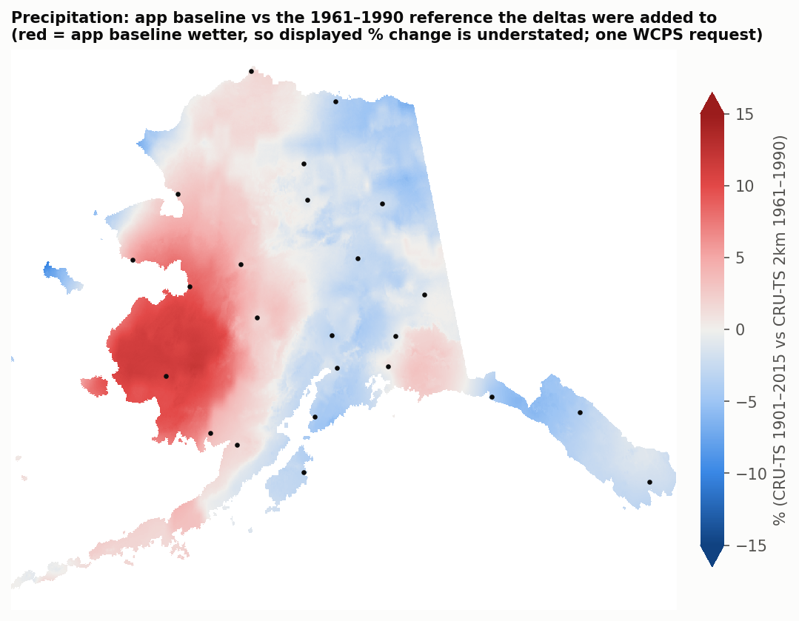

**Fig. 10: The 1961–1990 reference checked against the downloaded PRISM files.** Left and middle: site values. Right: leftover terrain detail in AR5 minus each candidate climatology (smaller = shared underlying climatology).
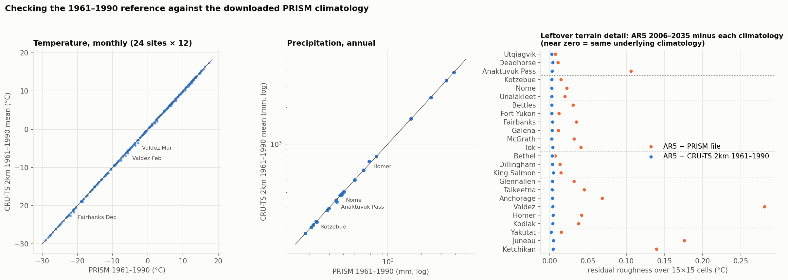

**Fig. 11: Precipitation baseline offset by site and era** (annual totals, vs the CRU-TS 2 km 1961–1990 mean). There is no monthly CRU-TS 4.0 precipitation in Rasdaman (the app's precip coverage stores annual totals only), so unlike Fig. 8 this is by era rather than by month. The mm offset is the same in every era, but the percentage-point shift grows slightly as projected totals rise.
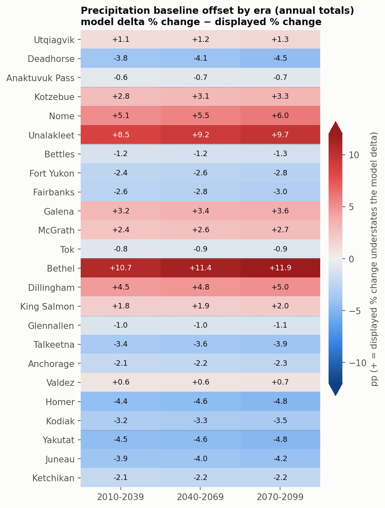

---

## Side observation (not investigated)

In the projected temperature summary, [taspr.py:823](../routes/taspr.py#L823) sets `monthly_max = max(monthly_mean_values)`, with the matching line for min. So the projected monthly "tasmax"/"tasmin" columns are the max/min of monthly *means*, not of tasmax/tasmin. That may be intentional, but it's worth confirming.

## Reproducing

Use the `api-env` conda environment and set `PROJ_DATA` to its `share/proj` directory. `PRISM_DIR` is the folder of SNAP PRISM 1961–1990 2 km GeoTIFFs (`tas/`, `pr/`, …) from the GeoNetwork record above:

```sh
cd delta_change_method
python fetch_site_data.py        # ~8 min; caches point cubes for all EDS coverages to data/raw/
python check_gcm_historical.py   # which coverages contain GCM historical runs
python analyze.py                # degree days: current vs delta change method
python prism_check.py PRISM_DIR            # PRISM file vs CRU-TS 2 km 1961–1990 mean at the sites
python climatology_consistency.py PRISM_DIR  # which climatology the AR5 projections share their fine-scale pattern with (~2 min)
python ar5_baseline.py PRISM_DIR            # temperature & precipitation: baseline offset
python wcps_server_side.py       # server-side validation, cap check, statewide GeoTIFFs
python make_figures.py           # figures/
```

| File | Purpose |
|---|---|
| `sites.py` | The 24 test sites |
| `wcps.py` | WCPS helpers |
| `data/raw/` | Cached point cubes |
| `data/maps/*.tif` | Statewide grids (git-ignored; regenerate with `wcps_server_side.py`) |
