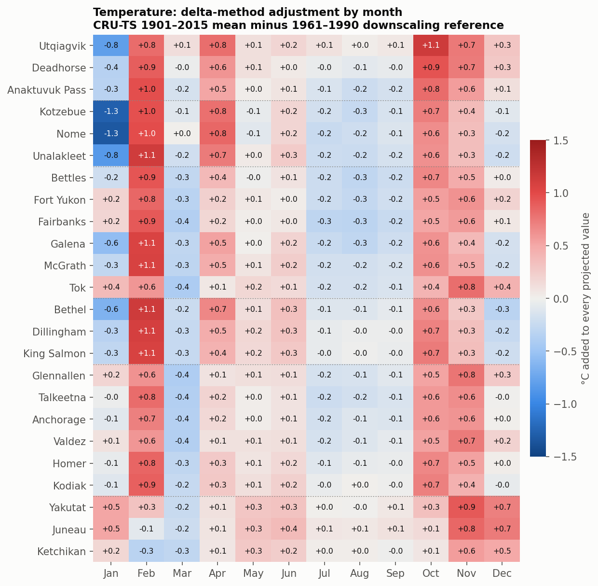
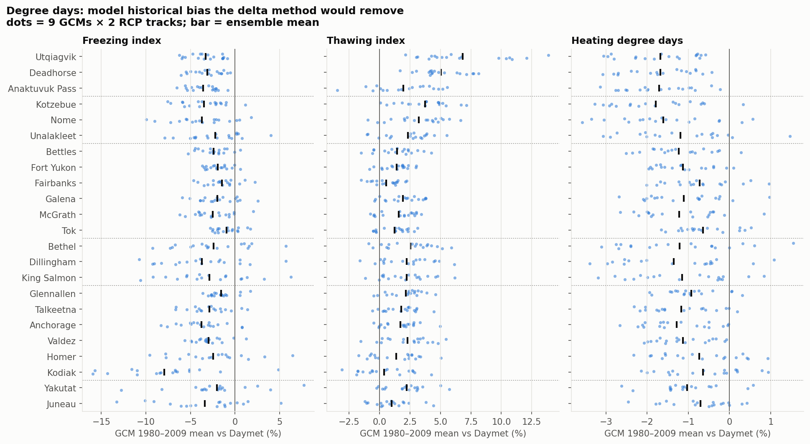
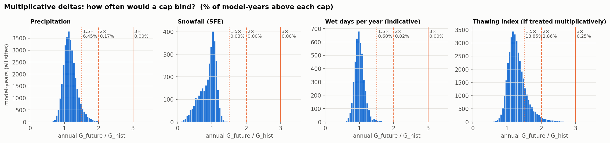
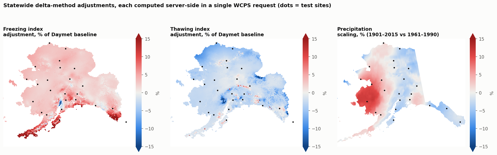

# Delta change method in Arctic-EDS

**Question.** Does Arctic-EDS apply the delta change method? If not, can Rasdaman/WCPS do the math for us, and how much would the numbers in the app change?

**Method under review** (from the issue):

| Variable type | GCM delta | Future value |
|---|---|---|
| Not zero-bounded (temperature, degree days) | `G_future − G_hist` | `Baseline + delta` |
| Zero-bounded (precipitation, snowfall, wet days) | `G_future / G_hist` | `Baseline × delta`, with a multiplier cap |

All numbers below are from 24 test sites across 7 Alaska regions, pulled from the production Rasdaman (`zeus.snap.uaf.edu`) on 2026-10-08. Every "current" value was checked against the live `earthmaps.io/eds/all` response, and all of them reproduce it.

---

## TL;DR

1. **The API and the app never apply the delta change method.** No code path in `/eds/all` or the Arctic-EDS frontend takes a model's future value relative to its own historical run. Each plate shows observed or reanalysis baseline statistics next to raw model-future statistics, and the frontend subtracts one from the other ([Evidence](#a-is-the-delta-change-method-applied)).
2. **Some of the source data already has a delta step baked in, but against a different baseline.** The SNAP AR5 2 km temperature, precipitation and snowfall products were delta-downscaled during production against a 1961–1990 (or 1971–2000) PRISM climatology. The app compares them with 1901–2015 (or 1910–2009) CRU-TS statistics, so the periods don't match. The degree-day (NCAR 12 km) and wet-day (WRF) values have no delta step at all.
3. **WCPS can do the math server-side.** Additive, multiplicative and capped deltas all work in one request per point (0.1–0.6 s) and match a Python reference implementation to within 0.04. Statewide grids also work (0.8 s at 12 km, 77 s at 2 km). Two catches:
   - GCM historical runs are not in Rasdaman for temperature, precipitation, snowfall or wet days.
   - A few rasdaman quirks need workarounds ([Part B](#b-can-wcps-do-it-server-side)).
4. **For most components the difference is small, but not negligible at some sites.** For the mid-century mean the app displays:

| Component | Typical shift | Worst site |
|---|---|---|
| Temperature | +0.1 to +0.3 °C annual, up to ±1.3 °C in individual months | ±1.3 °C (Kotzebue and Nome, January) |
| Heating degree days | ~1 pp | 1.8 pp |
| Thawing index | ~2 pp | 6.8 pp |
| Freezing index | ~3 pp | 8.0 pp (Kodiak) |
| Precipitation | ~3 pp | 11.4 pp (Bethel: +4% becomes +16%) |
| Snowfall (SFE) | ~6 pp | 12.9 pp, and the sign of the change flips at 5 sites |
| Wet days | ~16 pp | 58 pp. Indicative only: no GCM historical exists for this dataset |

   "pp" means percentage points of the displayed % change from the baseline. Ranges and extreme values (min/max) move more than means; a freezing-index minimum can move by over 100%.
5. **At the annual scale the 3× multiplier cap almost never binds.** It never binds for precipitation, snowfall or wet days, and binds in 0.25% of thawing-index model-years if that index were treated multiplicatively. Divide-by-zero risk only appears at monthly or daily scales, which the app does not use.

---

## A. Is the delta change method applied?

**No.** The evidence is laid out below by component, then by code.

### What each component shows today

| EDS component | Coverage | "Historical" shown | "Future" shown | GCM historical in Rasdaman? | Delta applied in API/app? |
|---|---|---|---|---|---|
| Temperature | `tas_2km_historical_wcs` / `tas_2km_projected_wcs` | CRU-TS 4.0 2 km, 1901–2015 | AR5 2 km 5ModelAvg/GFDL/NCAR, 2006–2100 | **No.** The historical coverage has no model axis | No |
| Precipitation | `annual_precip_totals_mm` | CRU-TS 4.0 2 km, 1901–2015 | AR5 2 km, 5 GCMs × 3 RCPs | **No.** GCM slices are empty before 2006 | No |
| Snowfall (SFE) | `mean_annual_snowfall_mm` | CRU-TS 3.1 771 m, 1910–2009 | AR5, 5 GCMs × 3 RCPs, 2010–2099 | **No.** GCM slices are empty before 2010 | No |
| Freezing / thawing index, HDD | `air_*_index_Fdays`, `heating_degree_days_Fdays` | Daymet ("modeled baseline"), 1980–2009 | NCAR 12 km, 9 GCMs × 2 RCPs | **Yes.** 1950–2005 sits in the RCP tracks | No |
| Wet days per year | `wet_days_per_year` | ERA-Interim WRF 20 km, 1980–2009 | GFDL-CM3 / NCAR-CCSM4 WRF, RCP 8.5, 2006–2100 | **No.** GCM data starts in 2006 | No |

The other components are out of scope here: permafrost, hydrology, elevation and precipitation frequency are model outputs or static data, not baseline-vs-GCM comparisons.

### Code evidence (API)

The summaries are plain min/mean/max over raw coverage values. Nothing references a model's own historical period.

- **Precipitation.** [taspr.py:1442](../routes/taspr.py#L1442) computes the historical statistics from CRU-TS. [taspr.py:1456–1469](../routes/taspr.py#L1456-L1469) then pools every GCM × RCP annual value in each era and takes min/mean/max.
- **Temperature.** [taspr.py:767–860](../routes/taspr.py#L767) averages the projected `tas_2km` values per era. No historical model run is ever requested, and the coverage has none.
- **Degree days.** [degree_days.py:534–560](../routes/degree_days.py#L534-L560) takes Daymet 1980–2009 statistics as `modeled_baseline` and pools raw GCM values per era. The GCM 1980–2009 values are in the coverage but are never read.
- **Snowfall.** [snow.py:85–116](../routes/snow.py#L85-L116) takes CRU decades as historical and pools all GCM decades as projected.
- **Wet days.** [wet_days_per_year.py:44](../routes/wet_days_per_year.py#L44) splits the coverage by year range: 1980–2009 is ERA-Interim and 2006–2100 is the GCMs.
- A search across all EDS routes for `delta|anomal|bias|ratio` finds nothing relevant. Delta and anomaly logic exists only in unrelated endpoints (`temperature_anomalies.py`, `arctic_hydrology.py`, `conus_hydrology.py`, `fire_weather.py`).

### Code evidence (Arctic-EDS frontend, `ua-snap/arctic-eds@a25b445`)

- `app/components/Diff.vue` computes `future − past` (abs) or `(future − past) / past` (pct). It is display arithmetic on the API's baseline and future means, not a delta-change adjustment.
- The degree-day plates use `kind="pct"` and the temperature and precipitation plates use `kind="abs"`. So the "change" a user reads is `GCM_future − Baseline`. That number mixes the climate signal with any model bias and any baseline-period mismatch.
- The plate text already says the data are *"statistically downscaled and bias corrected via the delta method"*. That is true of how SNAP produced the AR5 2 km data, but only relative to the 1961–1990 PRISM climatology, not the 1901–2015 CRU-TS baseline the same plate displays. It is not true of the degree-day or wet-day values.

### Why "already delta-downscaled" isn't the same as "delta change method applied"

SNAP's AR5 2 km products were made like this ([SNAP catalog record](https://catalog.snap.uaf.edu/geonetwork/srv/api/records/ba834996-ad15-4785-9b43-ef2af86a5ad9); ingest notebooks in `ua-snap/rasdaman-ingest/arctic_eds/annual_mean_pr` and `.../annual_mean_snowfall`):

```
AR5_2km(t)    = PRISM_1961-1990 + (GCM(t) − GCM_1961-1990)          # per month
CRU-TS_2km(t) = PRISM_1961-1990 + (CRU(t) − CRU_1961-1990)
```

So, by construction, the 1961–1990 mean of a downscaled GCM equals PRISM, which equals the 1961–1990 mean of CRU-TS 2 km at every pixel. The delta is already relative to 1961–1990. The app compares it to a 1901–2015 mean, and those are different numbers.

Two caveats on this assumption:
- The catalog record states the 1961–1990 PRISM baseline for the 2 km product, but names the delta method explicitly only for the [10-min sibling product](https://catalog.snap.uaf.edu/geonetwork/srv/api/records/815c6708-b6cf-4a46-b5c8-344851063117). For 2 km, the delta-method claim rests on the ingest notebooks and the app's own text.
- For SFE (771 m, PRISM 1971–2000, nonlinear in tas and pr), the identity is approximate.

---

## B. Can WCPS do it server-side?

**Yes, for every case where the inputs exist.** [`wcps_server_side.py`](wcps_server_side.py) runs the full calculation in Rasdaman for every test site and checks it against [`analyze.py`](analyze.py):

| Component | Formula run in WCPS | Mean time per point | Max \|WCPS − Python\| |
|---|---|---|---|
| Temperature | `B + (G_fut − G_hist)`, two coverages in one query | 0.10 s | 0.000 |
| Precipitation | `B × mean(min(G_fut / G_hist, 3))` over 15 model × RCP runs | 0.43 s | 0.000 |
| Freezing / thawing / HDD | `B + mean(G_fut − G_hist)` over 18 model × RCP runs | 0.20 s | 0.04 °F·days (from the zero floor applied in Python only) |

Example: the degree-day delta for one point, all 9 GCMs × 2 RCPs, in one request:

```
for $c in (air_freezing_index_Fdays)
let $b := avg($c[model(0),scenario(0),year(1980:2009),X(x),Y(y)])
return encode(
  coverage delta over $m model(1:9), $s scenario(1:2)
  values $b + ( avg($c[model($m),scenario($s),year(2040:2069),X(x),Y(y)])
              - avg($c[model($m),scenario($s),year(1980:2009),X(x),Y(y)]) ),
  "application/json")
```

Caps work with `min(ratio, 3.0)`, `switch case … return … default return …`, or boolean masks.

**Statewide grids** also work, one request per map:

| Map | Resolution | Time | Size |
|---|---|---|---|
| Degree-day adjustment | 12 km | 0.8 s | 0.6 MB |
| Precipitation scaling | 2 km | 77 s | 16 MB |

The 2 km map is too slow for on-demand use, but fine to precompute or cache ([Fig. 6](#figures)).

### Limitations and quirks found

1. **The real blocker is missing inputs, not WCPS.** GCM historical runs were never ingested for the AR5 tas/pr/SFE coverages or for the WRF wet-days coverage. For AR5, CRU-TS 1961–1990 is an exact stand-in, because of the downscaling identity above. For wet days, the WRF GCM historical runs (1970–2005, on SNAP storage) would need to be ingested.
2. **Mixed-length `avg()` fails.** `avg()` over a 115-year slice combined with `avg()` over a 30-year slice raises *"axes not compatible"*. Workaround: cast each aggregate, as in `(double)avg(...)`.
3. **`condense` over a `year` iterator mis-indexes.** It sends geo years to the wrong grid index, and over an ANSI date axis it hung for more than 2 minutes. Workaround: write out explicit sums of year slices and send the query by POST.
4. **`tas_2km_projected_wcs` has an irregular scenario axis.** Its coefficients are `0, 2`, so RCP 8.5 is `scenario(2)` even though the metadata encoding labels it `"1"`.
5. **GeoTIFF axis order differs by coverage.** The NCAR 12 km coverages come back with X/Y transposed; the AR5 2 km precipitation coverage does not.

---

## C. How big is the difference?

### Method per component

`B` is the baseline the app already shows. Every future value (each model × RCP × year) is adjusted, then summarized exactly the way the API summarizes it today.

| Component | Type | B | G_hist | Notes |
|---|---|---|---|---|
| Temperature | additive | CRU-TS 1901–2015 | CRU-TS 2 km 1961–1990 (= downscaled GCM 1961–1990) | 5ModelAvg RCP 8.5 annual, as the app shows |
| Precipitation | multiplicative, 3× cap | CRU-TS 1901–2015 | CRU-TS 2 km 1961–1990 | Uncapped, 2× and 1.5× also computed |
| Snowfall | multiplicative, 3× cap | CRU-TS 1910–2009 | CRU-TS decades 1970–1999 | Approximate (771 m, PRISM 1971–2000) |
| Degree days | additive, floor 0 | Daymet 1980–2009 | Each GCM × RCP 1980–2009 | **True delta, nothing approximated.** Multiplicative variant also computed |
| Wet days | multiplicative, 3× cap | ERA-Interim 1980–2009 | Inferred from the 2006–2009 overlap | **Indicative only:** 4 overlap years |

For tas, pr and SFE the delta method therefore reduces to correcting the baseline period: `+ (B − CRU_ref)` or `× B / CRU_ref`. For degree days it removes each model's own bias against Daymet.

### Results: mid-century (2040–2069; snowfall 2010–2099), 24 sites

| Component | Mean value shift (delta − current) | Median \|shift\| in displayed % change | Max \|shift\| | Where it's largest |
|---|---|---|---|---|
| Temperature (annual) | +0.16 °C (range +0.07 to +0.30) | 0.15 °C of a ~4.2 °C change (~4%) | +0.30 °C | Utqiagvik, North Slope |
| Temperature (monthly) | −1.3 to +1.2 °C | — | 1.3 °C | Kotzebue and Nome, January |
| Precipitation | −12 mm (−171 to +48) | 2.9 pp | 11.4 pp | Bethel, Unalakleet, Nome (up); Yakutat, Homer (down) |
| Snowfall (SFE) | +5 mm (−33 to +45) | 6.3 pp | 12.9 pp | Sign flips at Utqiagvik, Tok, Kotzebue, Fort Yukon, Glennallen |
| Freezing index | +107 °F·d (16 to 279) | 2.9 pp | 8.0 pp | Kodiak, southern coast |
| Thawing index | −55 °F·d (−83 to −12) | 1.9 pp | 6.8 pp | Utqiagvik, Deadhorse |
| Heating degree days | +162 °F·d (61 to 330) | 1.2 pp | 1.8 pp | Uniform |
| Wet days* | −19 days (−51 to +21) | 16 pp | 58 pp | North Slope, Northwest |

The full per-site, per-era table is in [`data/comparison.csv`](data/comparison.csv); every min/mean/max, method and cap is in [`data/summary_long.csv`](data/summary_long.csv).

Additive adjustments are constant across eras. Multiplicative ones scale with the projected value, so late-century shifts are proportionally the same.

**Degree-day min/max ranges move more than means** ([Fig. 7](#figures)). Each GCM gets its own offset, which tightens the ensemble spread. At mid-century, median freezing-index changes are:

| Statistic | Median change | Largest change |
|---|---|---|
| Mean | 4.5% | — |
| Minimum | 4.3% | 152% (Kodiak: 9 to 23 °F·days, a near-zero minimum) |

### Multiplier caps and thresholds

At the annual totals the app uses, ratios are well-behaved ([Fig. 5](#figures)). Share of model-years above each cap:

| Variable | > 1.5× | > 2× | > 3× |
|---|---|---|---|
| Precipitation | 6.4% | 0.17% | 0 |
| Snowfall | 0.03% | 0 | 0 |
| Wet days | 0.6% | 0.02% | 0 |
| Thawing index, if multiplicative | 18.9% | 2.9% | 0.25% |

A 3× cap is a harmless safety net here. A 1.5× cap would clip real precipitation signal in 6% of model-years. No GCM historical value is anywhere near zero at the annual scale: the smallest is 183 mm for precipitation and 67 mm for SFE. A minimum-value threshold only becomes necessary if the method moves to monthly or daily data (monthly precip, monthly SFE in shoulder seasons, daily wet-day counts).

---

## Recommendations

1. **Degree days: apply the delta method.** It is a true delta with all inputs in Rasdaman, and the WCPS query exists and is validated. Use additive with a floor at 0. It mostly shifts ranges and modestly corrects means, with the largest effect along the southern coast.
2. **Temperature, precipitation, snowfall: pick one consistent baseline.** The cheapest fix is to apply `+ (B − CRU_1961-1990)` or `× B / CRU_1961-1990`, which can be done in WCPS today. The alternative is to display 1961–1990 as "historical". Either way the plate's "change" then becomes a pure climate signal. For monthly temperature tables the correction matters more (up to ±1.3 °C) than the annual numbers suggest.
3. **Wet days: don't apply the indicative delta.** Ingest the WRF GCM historical runs (1970–2005) first. The 4-year overlap suggests the raw GCM–ERA-Interim offset is large (as much as +58 pp on the North Slope), so this plate is the most likely to be misleading as-is. Note that the current frontend doesn't render a wet-days plate.
4. **Keep a 3× cap and add a tiny-denominator threshold as defensive defaults** in any shared implementation. Neither binds for current EDS data, but both matter if this becomes a standard across apps that use monthly or daily data.
5. **Do it in WCPS for points; precompute grids.** Point queries add about 0.1–0.6 s per component. 2 km statewide fields should be precomputed or cached rather than generated per request.

---

## Figures

**Fig. 1: Displayed change from baseline, current (blue) vs delta method (orange), mid-century.**


**Fig. 2: Shift in the displayed % change (pp) by site and component.**


**Fig. 3: Temperature adjustment by month.** The annual number hides a ±1 °C seasonal pattern.


**Fig. 4: Degree days: each GCM's 1980–2009 bias against Daymet.** This is what the delta method removes.


**Fig. 5: How often multiplicative caps would bind.**


**Fig. 6: Statewide adjustments, each computed server-side in one WCPS request.**


**Fig. 7: Freezing-index min/mean/max as the app reports it, current vs delta.**


---

## Side observation (not investigated)

In the projected temperature summary, [taspr.py:823](../routes/taspr.py#L823) sets `monthly_max = max(monthly_mean_values)`, with the matching line for min. So the projected monthly "tasmax"/"tasmin" columns are the max/min of monthly *means*, not of tasmax/tasmin. That may be intentional, but it's worth confirming.

## Reproducing

Use the `api-env` conda environment and set `PROJ_DATA` to its `share/proj` directory:

```sh
cd delta_change_method
python fetch_site_data.py    # ~8 min; caches point cubes to data/raw/
python analyze.py            # current vs delta summaries -> data/*.csv
python wcps_server_side.py   # Part B: server-side validation + statewide GeoTIFFs (~2 min)
python make_figures.py       # figures/
```

| File | Purpose |
|---|---|
| `sites.py` | The 24 test sites |
| `wcps.py` | WCPS helpers |
| `data/raw/` | Cached point cubes |
| `data/maps/*.tif` | Statewide grids (git-ignored; regenerate with `wcps_server_side.py`) |
